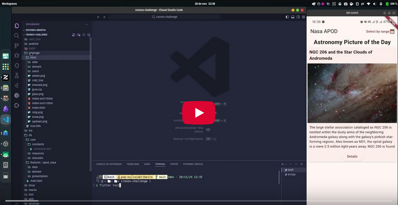

# Cronos Challenge

This app implements [NASA's Astronomy Picture of the Day (APOD) API](https://github.com/nasa/apod-api?tab=readme-ov-file#astronomy-picture-of-the-day-apod-microservice).

## Tech

Developed in [Flutter].

## ARCHITECTURE 

⚠️ Please refer to the [ARCHITECTURE](./ARCHITECTURE.md) document for detailed information on the architectural rules followed in this app.

## Features

**1. Today's Picture of the Day Page**

- Displays the picture of the day fetched from NASA's APOD API, along with an explanatory text and a button to navigate to the details page.

**2. Select Range of Days to Display Astronomy Pictures**

- Allows the user to choose a date range. Upon confirmation, it displays a list of pictures for each day within the selected range, with a button to navigate to the details page.

**3. Astronomy Picture Details Page**

- Shows the full explanatory text and the published date of the selected picture.

## Presentation

 [](https://youtu.be/kPs7f5uVzjA)            


## Installation and Running

Install the dependencies and run the project.

```sh
flutter pub get
flutter run
```

## Run Tests
Run all tests at once.

```sh
flutter test
```

Run all tests and generate an LCOV file.

```sh
flutter test --coverage
```

Generate a test report based on the LCOV file.

```sh
genhtml coverage/lcov.info -o coverage/html
```

## Building 

For production release follow the official Google Guide: [Flutter Build]

```sh
flutter build apk --split-per-abi
```


## License

MIT

[Flutter]: <https://flutter.dev/>
[Flutter Build]: <https://docs.flutter.dev/deployment/android>


